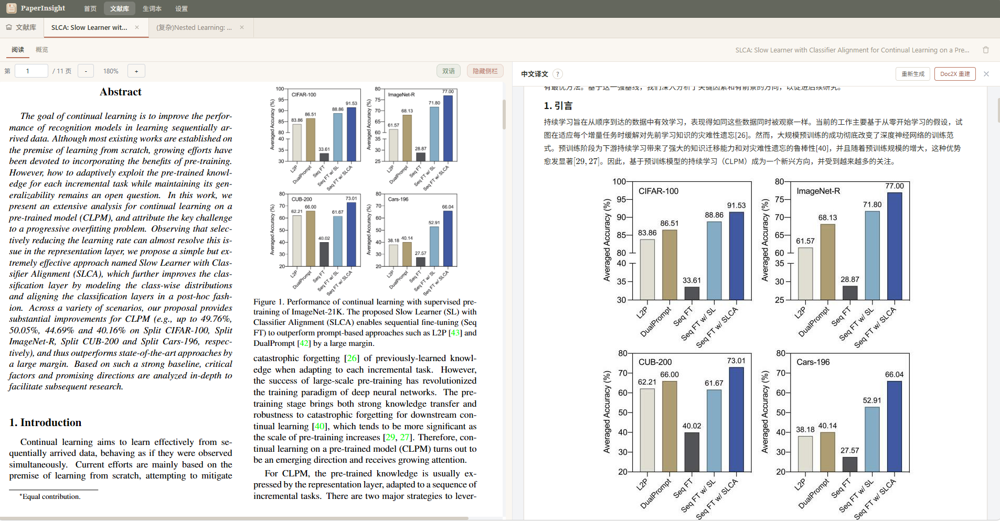
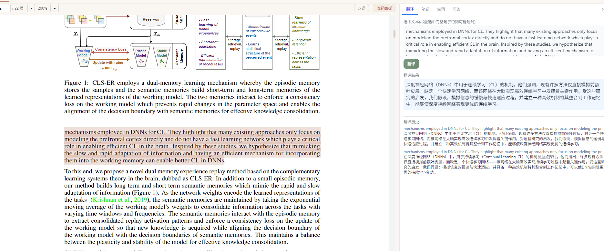
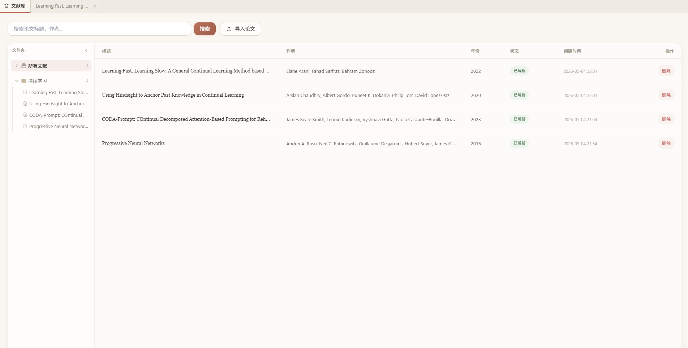
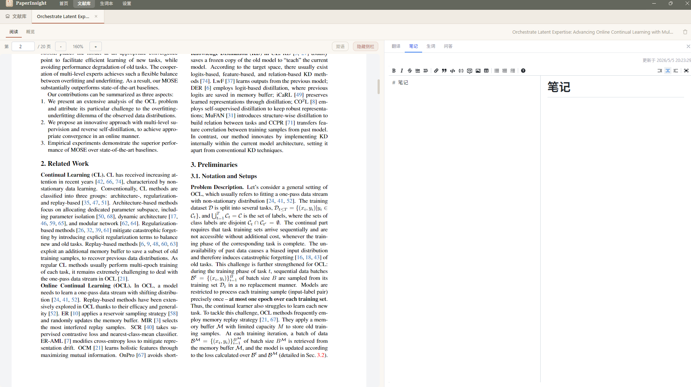
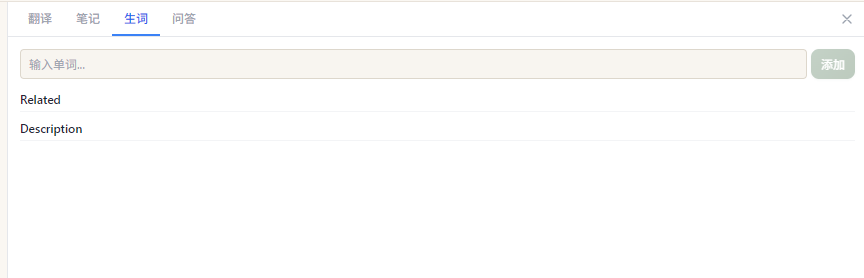
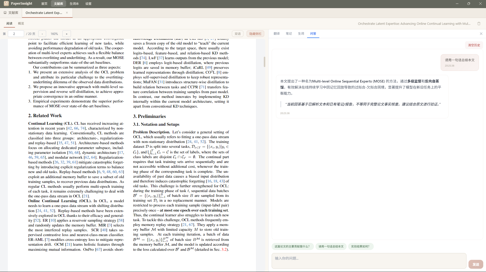

# PaperInsight Desktop

一款面向科研人员的本地学术论文阅读助手。导入 PDF 即可获得 AI 精读报告、双语对照翻译、划词翻译、笔记管理和生词本，所有数据保存在本地。

下载在右侧Release 页面下载。

## 功能介绍

### AI 精读报告

导入论文后一键生成结构化精读报告，涵盖核心贡献、关键方法、实验结果、局限性与未来方向，帮助你在几分钟内把握论文全貌。

### 划词翻译

在 PDF 阅读器中选中任意文本，点击翻译即可获得学术级中文译文。支持整篇论文的双语对照翻译，公式、引用和图表标记完整保留。

### 文献库

以树形文件夹管理你的论文 collection，支持拖拽归类、批量导入、按关键词搜索、按分类和年份筛选。

### 笔记系统

内置 Markdown 编辑器，支持数学公式渲染，实时预览。笔记结构面板可查看已引用的 AI 问答、翻译记录和生词，一键跳转回原文上下文。

### 生词本

阅读时遇到生词，选中后一键添加。自动记录上下文语境，AI 生成中英文释义，支持复习打分（0-10 分制）。每篇论文的生词独立统计，全局生词本支持搜索和筛选。

### AI 问答

围绕论文内容进行多轮对话，AI 自动关联论文上下文和历史对话记录，适合深入探讨方法细节、实验设计和公式推导。支持快捷问题模板，也可自由提问。

### Doc2X 云端解析（可选）

接入 Doc2X API 可获得更高精度的论文结构化解析，适合公式密集、排版复杂的论文。

### 中文 PDF 导出

将双语翻译结果生成排版完整的中文 PDF，方便离线阅读或分享。

## 安装与使用

1. 下载并安装 PaperInsight Desktop
2. 首次启动时选择一个文件夹作为论文库位置
3. 在「设置」页面配置 AI 服务（支持 DeepSeek、OpenAI、通义千问等兼容接口）
4. 在「文献库」页面导入 PDF 论文
5. 点击论文进入阅读，使用右侧面板进行翻译、提问或做笔记

## 系统要求

- Windows 10 / 11
- 需要网络连接（AI 服务和 Doc2X 为在线功能）

## 常见问题

**Q: AI 服务如何配置？**

在设置页面填入你的 API Key 和服务地址即可。推荐使用 DeepSeek，性价比高且中文效果好。

**Q: 论文数据保存在哪里？**

所有数据（PDF 文件、翻译、笔记、生词）保存在你选择的论文库文件夹中，不会上传到任何服务器。

**Q: Doc2X 是必须的吗？**

不是。PaperInsight 自带 PDF 解析能力，Doc2X 是可选的增强功能，适合需要更高解析精度的场景。
